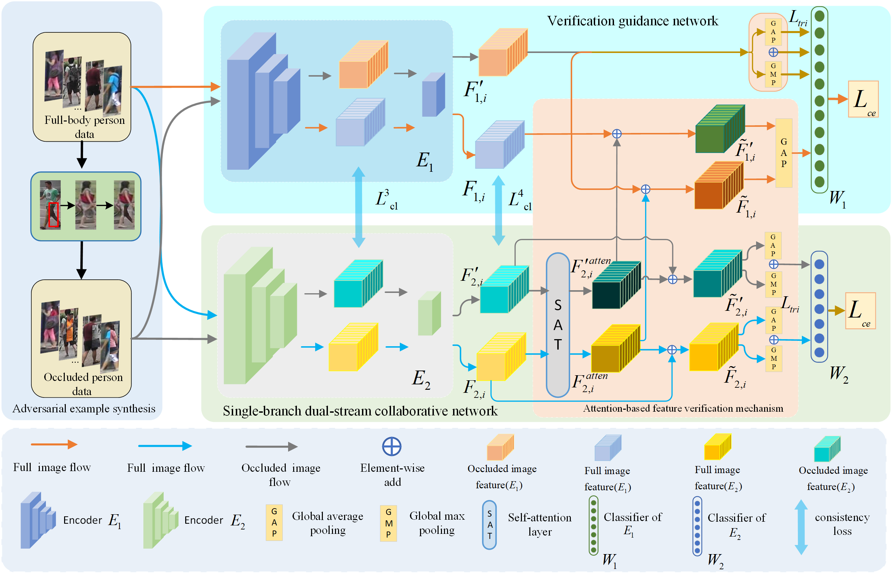

## Occluded Person Re-identification via Defending Against Attacks from Obstacles
A new person re-ID framework is design to defend the interference of obstacles, including two core parts, SDCN and verification guidance network. Under the guidance and cooperation of the pre-trained verification guidance
network, the framework realizes SDCN training on bothfull pedestrian samples and occluded pedestrian samples collaboratively. Correspondingly, SDCN gains an ability to defend against the attacks from adversarial samples (occluded samples).
It consists of occluded sample generation, verification guidance network, and SDCN. In the occluded sample generation, occluded pedestrian samples required by model training are generated, and used as adversarial samples to participate in the training of both verification
guidance network and SDCN. Both verification guidance network and SDCN are trained under occluded and full pedestrian image samples, respectively. After the verification guidance network training is completed, both occluded and full pedestrian images are input into SDCN. 
Additionally, the full pedestrian images are input into the pre-trained verification guidance network. The adversarial training of SDCN is completed under the constraints and verification of the verification guidance network.

### Usage
- This project is based on the strong person re-identification baseline: Bag of Tricks[2] ([paper](https://openaccess.thecvf.com/content_CVPRW_2019/papers/TRMTMCT/Luo_Bag_of_Tricks_and_a_Strong_Baseline_for_Deep_Person_CVPRW_2019_paper.pdf) and [official code](https://github.com/michuanhaohao/reid-strong-baseline)).
- Usage of this code is free for research purposes only. 
- The model is learned by pytorch.
- for singal dateset could use main.py，for multi dateset could use main2.py
- when you need train a vnet,you could use main3.py train a scdnnet(need commented code related to nonlocal) and rename as vnet.
```
|____ core/
     |____ test.py/
     |____ test1.py/
     |____ train.py/
|____ main
|____ main2
|____ main3
```  
```
python test.py
```
### Set Up
```shell script
conda create -n horeid python=3.7
conda install pytorch==1.6.0 torchvision==0.4.0 -c pytorch
# GPU Memory >= 10G, Memory >= 20G
```
## Dataset Preparation
Download the raw datasets [Occluded-REID, P-DukeMTMC-reID](https://github.com/tinajia2012/ICME2018_Occluded-Person-Reidentification_datasets), and [Partial-Reid](https://pan.baidu.com/s/1VhPUVJOLvkhgbJiUoEnJWg) (code:zdl8) which is released by [Partial Person Re-identification](https://www.cv-foundation.org/openaccess/content_iccv_2015/html/Zheng_Partial_Person_Re-Identification_ICCV_2015_paper.html). Instructions regarding how to prepare [Market1501](https://www.cv-foundation.org/openaccess/content_iccv_2015/papers/Zheng_Scalable_Person_Re-Identification_ICCV_2015_paper.pdf) datasets can be found [here](https://kaiyangzhou.github.io/deep-person-reid/datasets.html). And then place them under the directory like:
Occluded DukeMTMC-reID ([Project](https://github.com/lightas/Occluded-DukeMTMC-Dataset))
## To Train Synthesis of Adversarial Samples(comment nonlocal and vnet )

``` 
 --dateset path
 --use_colorjitor --Ture
 --base_learning_rate' --lr 0.00002
 --batch-size 32 --base-lr-mult 0.5
```
## To Train Synthesis of  Verification Guidance Network(uncomment nonlocal and vnet )

``` 
 --dateset path
 --load vnet model
 --use_colorjitor --Ture
 --base_learning_rate' --lr 0.00002
 --batch-size 32 --base-lr-mult 0.5
```
- If you have any questions in use, please contact me. [liurun_531@163.com](liurun_531@163.com) . 

- Reference
```
[1]Juan Wang, Run L, Hua Li, et al. Occluded Person Re-identification via Defending Against Attacks from Obstacles.
[2]Luo H, Gu Y, Liao X, et al. Bag of tricks and a strong baseline for deep person re-identification[C]//Proceedings of the IEEE/CVF Conference on Computer Vision and Pattern Recognition Workshops. 2019: 0-0.
```